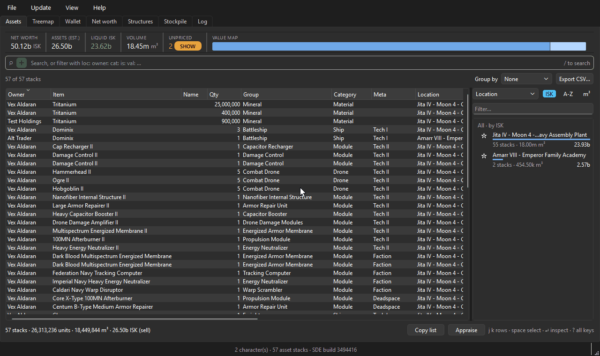

# EVE Booty

Desktop asset manager for EVE Online - all your plunder in one place. Point it at
your characters, hit sync, and get one searchable table of everything you own
across every hangar, ship, can and corp division, plus a chart of what each
character is worth over time.



Python 3.10+, PySide6, SQLite. Runs from source with `uv`, and ships for Windows
as a portable program folder built with Nuitka.

## Download

Two ways, both on the
[Releases](https://github.com/littlephish/eve-booty/releases/latest) page.

**Installer** (`EVEBooty-<version>-setup.exe`). Run it. Installs per user under
`%LOCALAPPDATA%\Programs\EVEBooty`, with Start menu and optional desktop
shortcuts, and an entry in Apps & features to uninstall from. No admin rights
and no UAC prompt.

**Portable zip** (`EVEBooty-<version>-win64.zip`). Unzip anywhere you can write
to and run `evebooty.exe`. Nothing is written outside the folder and your own
app data directory; to uninstall, delete the folder.

Either way, updates are handled in-app from Help → Check for updates. Both
layouts are the same program folder, so put the portable copy somewhere you
would be happy for it to update itself: `Program Files` needs admin rights and
is the one place it cannot update in place. That is also why the installer
defaults to a per-user location rather than `Program Files`.

If you take the zip, keep the folder together. `evebooty.exe` needs the DLLs
and the `evasset\` folder beside it, so running the exe from inside the zip, or
copying just the exe somewhere else, will not work.

Your assets, wallet history and settings live in `%APPDATA%\eve-booty` and are
untouched by either uninstalling or switching between the two.

**Windows will warn you the first time.** The build is not code-signed - a
certificate is a few hundred dollars a year, which this does not have - so
SmartScreen shows "Windows protected your PC". Click **More info → Run anyway**.
If you would rather not take that on faith, the zip is built entirely by
[GitHub Actions from a tagged commit](.github/workflows/release.yml), on public
runners, with no local uploads, so you can read exactly what produced it - or
run from source instead.

## What it does

- One asset table across all your characters and their corps, filtered through a
  single omnibox with a typed grammar (see below) and groupable by location,
  system, region, owner, category or group - collapsible headers carry live
  stacks / m³ / ISK rollups for whatever the filter leaves
- Container trees flattened, so a module in a can in a ship in a station still
  reports the station
- Items sitting in Asset Safety show up labelled as such rather than as an
  unresolvable location -- ESI's asset endpoint gives Asset Safety a fixed
  location id (2004) that is not a real station, system or structure, so it
  needs its own case rather than an ESI lookup that would just 404
- Right-click a ship and View fit to see everything on it: fitted modules and
  loaded charges (paired up even though ESI reports both under the same slot),
  drones, fighters, cargo, fleet hangar and every specialized hold
- Copy a fit straight into Pyfa as ESI fitting JSON, or as EFT text for a
  forum post or the in-game fitting window
- A rollup rail beside the table: every location (or system, region, owner,
  category, group) with its stacks, volume, value and a proportional value bar.
  One click adds the label as a filter chip; stars pin favourites to the top,
  and unresolved "Unknown location" entries fold into one row. When you search
  for an item by name the rail flips to "where is it" - per-location quantities
  of the matched items
- A Treemap tab showing the same rollups as area, so "most of my ISK is in
  implants" is a glance rather than a read. Group by item group, system,
  region, owner or category; size by Jita buy or sell; right-click a tile to
  send it to the Assets tab as a filter chip
- A Stockpile tab: target quantities per item, scoped to an owner and to a
  station, system or region, with held / target / shortfall recomputed on every
  sync and the shortfall costed in ISK and m³. What counts as "held" is opt-in
  per stockpile - assets always, plus sell orders, contracts and in-progress
  manufacturing if you want them, because "still mine" and "can undock with it
  now" are different questions. A doctrine multiplier scales every target at
  once, and Copy shortfall gives you EVE multibuy text
- A Structures tab covering the citadels you and your corp can see: fuel
  expiry, reinforcement timers and moon drills, in UTC because that is what CCP
  states timers in. Unanchored ones drop out of it: ESI never announces an
  unanchor - the structure just stops being reported - so sync marks what went
  missing rather than deleting it, because assets still recorded there need its
  name to resolve. Their frozen state and fuel clocks are blanked rather than
  counted down to a date nothing will refresh, and an Unanchored tick box brings
  them back when you want to look
- An estate strip above the table - net worth, assets, liquid ISK, volume,
  unpriced count and a one-row value map of your top locations - always
  whole-estate, never faceted by the filters below it
- A row inspector: click a row (or `Enter`) for a panel beside the table, or
  right-click → Inspect in window to pin one item in its own window while you
  keep browsing; either shows both price bases, price source and quote age,
  volume, location and slot, plus Where else? / Refresh price / Pin price…
- Honest price flagging: unpriced and manually pinned stacks are badged in the
  value cells, quotes older than 48 h carry their age, and a manual price is
  never overwritten by a reprice until you unpin it
- Abyssal (mutated) modules show their actual rolled stats in the inspector --
  each roll as a bar across the mutaplasmid's possible range with a
  better/worse verdict against the un-mutated module -- and the rolls are
  searchable: `stat:` by value, `roll:` by quality, an `abyssal` chip that
  narrows to module types and opens a card of sliders for multi-stat
  searches, and per-type roll columns in the table (see below)
- Net worth per character, snapshotted on every sync and charted over time at
  both Jita buy and Jita sell, split into assets / wallet / sell orders / buy
  escrow / contracts / in-production
- Wallet journal and market transactions, filterable by owner, date range, ref
  type and buy/sell, with counterparty names resolved
- CSV export of whatever the current filter shows
- A `--sync` CLI mode so you can put it on a scheduler and just look at the chart

## The Assets tab

Everything that narrows the table is a token in one search field. Bare words
match item and custom names; everything else is a `prefix:value` chip:

```
loc:"Jita IV - Moon 4"     sys:Jita      region:"The Forge"
owner:Main                 cat:Ship      group:Battleship      meta:"Tech II"
is:fitted  is:safety  is:unpriced  is:bpc
val:>10m   val:<1b
abyssal    abyssal:"Abyssal Stasis Webifier"    abyssal:"Abyssal Stasis Webifier, Abyssal Warp Disruptor"
stat:cpu<26   stat:"Missile Damage Bonus">10   stat:web<-55   stat:duration<9   stat:cpu=18..22
roll:web>=70   roll:cpu=60..90   roll:"Missile Damage Bonus"<50
-owner:Alt                 (a leading - negates any token)
```

`stat:` compares one attribute of an abyssal module -- any attribute ESI
reports for the item, rolled by its mutaplasmid or not, so `stat:cpu<26` finds
a module by its CPU even when the mutaplasmid never touched CPU; the inspector
lists only the rolled ones -- in the units the inspector shows: `duration<9`
means nine seconds even though the game stores milliseconds, and a `+10.77%`
missile bonus is matched by `>10`, not by the stored `1.1077`. The comparison
is against the exact display value; the inspector rounds values of ten or
more to whole numbers, so a CPU shown as `26 tf` may really be 25.8 and fail
`stat:cpu>=26`. The name can be the attribute's display name (`"CPU usage"`,
quoted because of the space), its internal SDE name (`speedFactor`), or one
of the short aliases -- `cpu`, `pg`/`power`/`grid`, `cap`, `range`/`optimal`,
`falloff`, `rof`, `web`/`speed`, `velocity`, `damage`/`dmg`, `hp`,
`duration`/`cycle`, `neut`, `nos`, `sig`, `shield`, `armor`/`armour`,
`tracking`, `mass`. An internal name is matched before a display name, since
two attributes can share one display name (the percentage and the metres
flavour of a microwarpdrive's signature bloom both display as "Signature
Radius Modifier"); the completer offers the internal names when that happens.
Operators are `<`, `<=`, `>`, `>=`, and `name=lo..hi` is an inclusive range
(`stat:cpu=18..22`); negative numbers are fine (`stat:web<-55` is a web
stronger than 55%). Items whose rolls have not been fetched cannot match a
`stat:` chip, and are kept by a negated one -- `-stat:cpu<26` hides only the
modules known to be under 26 tf.

`abyssal` on its own is a chip for every mutated module, fetched or not. It is
the type flag, so a stack of mutaplasmids is not abyssal even though the game
colours it the same; `is:abyssal` still parses to the same chip. Give it a
value and it narrows to named module types, several joined by commas and OR'd:
`abyssal:"Abyssal Stasis Webifier, Abyssal Warp Disruptor"`. The chip reads
"Abyssal", "Abyssal · Stasis Webifier" or "Abyssal · 2 types".

`roll:` is the other way to ask about a rolled stat: not its value but the
roll's quality -- how far along the mutaplasmid's possible range it landed, as
a percent with 100 always the good end. `roll:web>=70` finds webifiers whose
velocity bonus rolled in the top 30% of what the mutaplasmid could give,
whichever direction "good" runs for that attribute; `roll:cpu=60..90` is an
inclusive range. Only the attributes the item's mutaplasmid rolls have a
quality, so `roll:` never matches an un-rolled attribute where `stat:` would
happily compare its stored value. Both take the same names and aliases, and
both are blind to items whose rolls have not been fetched (a negated `-roll:`
keeps them). Several `roll:`/`stat:` chips AND together; the types inside the
abyssal chip OR.

Typing `abyssal` and pressing Enter opens the complex-search card under the
new chip, and the chip's `▾` button reopens it later (a chip a saved view or
the rail puts in place waits for the button). The card is a dropdown of the
abyssal module types you own, with counts faceted by your other chips, that
you can also type into: the card opens with the type field focused, a few
letters (of the short label or the full name, "Abyssal" prefix and all)
narrow the list, Enter takes the highlighted or first match and leaves the
card open, and text matching no type snaps back to the current pick. A bare
`abyssal` chip opens the card with no type picked and the field empty; there
is no "All" entry, since the chip already means every abyssal item until a
type narrows it -- clearing the field (and Enter, or leaving it) is the way
back to every item from a type. Once a type is picked (every type rolls its
own set of attributes, so the rows need one), add a stat row per constraint:
the attribute, a two-handled slider and two number fields in the stat's own
units (the `tf`, `%` or `m` the inspector shows), the slider running between
the estate's own minimum and maximum for that stat within that type. Done
writes the chips back into the omnibox -- the abyssal chip plus one `stat:`
chip per row, replacing the card's previous abyssal and `stat:` chips and
leaving every other chip alone -- and the table reloads once. `roll:` stays
a typed filter: the card neither builds nor edits a `roll:` chip, so one
typed beside the card's own survives Done as it was. Done also settles
spelling: a chip typed as `stat:cpu>40` comes back as `stat:CPU usage>=40`,
since a row names its attribute the way the picker
does and a slider handle has no position for "just above" -- the filter
means the same rows, only written the canonical way. A chip naming several
types (typed, or recalled from a saved view) opens with the first of them
picked, and Done writes that one alone -- several types OR'd inside one chip
stay a typed affair. Cancel, Esc or a click anywhere else changes nothing. A
banner counts the items of the picked type (or of every type) whose rolls
have not been fetched, with a Fetch button that starts the same job as
Update → Abyssal stats for exactly those items.

With the chip on a single type the table grows one column per rolled
attribute after Qty, plus a Roll column. Each cell shows the display value the
inspector would (`27 tf`, `-63%`) washed by its roll quality -- towards red
below the middle, towards green above, plain around 50% -- and Roll is the
item's mean quality over its rankable rolls. Like the `stat:` caveat above,
the Roll column rounds (a mean of 38.6% shows as `39%`) while `roll:`
compares the exact quality, so `roll:cpu>=39` can miss an item whose column
reads 39%. The columns appear only once an item of the type has been fetched
-- they are the attributes your items actually carry values for, not
everything the mutaplasmid could roll. The columns sort by value,
survive a reload, export to CSV with the rest, and go away when the chip
names no type or several.

Typed tokens become deletable chips as you commit them, each washed in its
kind's own colour (negations always in red); rail rows, value-map segments
and the cell context menu all add chips the same way, and `Ctrl+F` (or the +
button) opens a two-stage chip builder that first lists what can be filtered
and then completes real values. Multiple chips of one kind OR together,
different kinds AND. `Esc` peels the newest layer of state; Clear all drops
the lot.

Selection maths live in the footer (units · m³ · ISK for the selection, or the
whole filtered set when nothing is selected), with Copy list (EVE multibuy
text) and Appraise, which sends the list to
[Janice](https://janice.e-351.com/) and opens the finished appraisal. The text
goes to the clipboard either way, so if Janice cannot be reached you still
have the list to paste in yourself.

Keyboard: `/` omnibox · `Ctrl+F` build a filter chip · `j`/`k` rows ·
`space` select · `f` filter to the focused cell · `x` exclude it · `w` where
else is this item · `Enter` inspector · `g` cycle group-by · `1`-`9` recall
a saved view, `Ctrl+1`-`9` save one (filter, grouping and rail level
together) · `?` the full key map.

Pins and saved views persist in the database next to the assets they
describe, so a copied database carries them along.

## Abyssal module stats

A mutated module's stats are not a property of its type -- every item is
rolled -- so the SDE only knows the generic "Abyssal X" and the market knows
nothing at all. ESI has one public route that returns an item's actual
attributes given its type and item id, both of which the assets sync already
stores, and the SDE carries the rest: attribute names and units, the source
module's base values, and each mutaplasmid's min..max multiplier range.

Open the inspector on an abyssal row and the Rolled stats section lists the
attributes the mutaplasmid touched (every attribute ESI reports is stored and
searchable with `stat:`; only the rolled ones are listed, and only they
answer `roll:`), one per line: the value in display units, how far along the
possible range it landed (a thin bar, and `61% of range` in text), and a
coloured `▲ +1.80 tf vs 24 tf` verdict against the un-mutated source. "Good"
follows CCP's own polarity data -- a webifier's velocity bonus going from
-60% to -63% is a better roll because lower is better there, so its bar
fills towards the strong end and the tooltip says so. Below the list: the
source module and mutaplasmid it came from.

Nothing is fetched until you ask, because ESI has no batch route and an
estate can hold hundreds of these. Three ways to ask:

- **Update → Abyssal stats** walks every abyssal item not yet asked about,
  one request each, and reports `fetched N, M not known to ESI, K failed`.
  Items answered once are never asked again; rolls are permanent.
- The **Fetch abyssal stats** button in the inspector, for one item now. It
  reads **Retry** on an item ESI has already said it does not know.
- **Settings → Behaviour → Fetch rolls for new abyssal items during sync**,
  off by default; the first successful manual run offers to turn it on.

The value cells wear an `abyssal` badge whose tooltip is the per-attribute
roll summary (`CPU 61% · Missile dmg 57% · RoF 66%`), or "Rolls not fetched"
until then. The badge is an explanation, not a price: abyssal items stay
unpriced -- `is:unpriced` finds them, the strip counts them, and totals do not
move -- because nothing first-party quotes them. The dogma tables behind all
this are part of the SDE import; an install whose SDE predates them re-imports
from the cached zip at the next startup, a few seconds of local work.
Primary-source notes on the ESI route, the SDE files and the unit rules are in
[`docs/research/abyssal-stats.md`](docs/research/abyssal-stats.md).

## Pricing

Every item carries two prices, both from
[Fuzzwork's](https://market.fuzzwork.co.uk/api/) Jita 4-4 aggregates in a single
request:

- **Jita buy** - the highest bid. What you get dumping the lot into standing
  orders right now.
- **Jita sell** - the lowest ask. What you get if you list it and wait.

Net worth is tracked on both, so the gap between the two lines on the chart is
what being in a hurry costs you. Wallet balance, sell orders and buy escrow are
already ISK, so they do not move with the basis.

### Capitals

Titans, supers, carriers, FAXes, dreads, lancers, capital industrials, freighters
and jump freighters mostly change hands by contract. Where Jita has a real
two-sided book we use it. Where it does not, the app scans public item-exchange
contracts across The Forge, Domain, Sinq Laison and Heimatar, keeps the ones that
are a single hull at a fixed price, drops anything more than 1.5 IQRs outside the
quartiles, and averages the rest. A contract price is one number rather than a
bid and an ask, so it fills both columns.

One thing worth knowing, because it is the difference between a correct number
and a catastrophically wrong one. Sampled on 2026-08-06, 42 of the 60 capital
hulls had a **one-sided** Jita book, and every titan sat on a lowball bid with no
asks at all - an Avatar bid at 1,324,000 ISK against a contract average near 170
billion. Mirroring that bid across to the sell side, which is the sensible thing
to do for a thin T2 module, would price a titan like a shuttle. So for
contract-priced groups a one-sided book is discarded outright: contracts decide,
and failing that the SDE base price, flagged `base_price` so you know it is a
placeholder rather than a market.

The group list, the scanned regions and both prefilters are editable in Settings,
along with a switch to make contract averages beat the market unconditionally.

## Wallet history outlives ESI

ESI serves roughly the last 30 days of journal and at most 2500 transactions.
Those two tables are the only ones the app appends to rather than replaces, so a
few months in, the local copy holds history CCP will no longer give you. Nothing
is ever deleted on sync, and re-syncing the same rows is a no-op.

The transactions endpoint has no page parameter - you rewind through it with
`from_id`. A routine sync stops after one call, because everything in the first
batch is already stored.

## ESI scopes

The full list lives in `SCOPES` in `src/evasset/config.py`. What each one buys:

| Scope | Feeds |
| --- | --- |
| `publicData` | Character and corp public info (names, tickers) |
| `esi-assets.read_assets.v1` | Character assets, plus container names |
| `esi-assets.read_corporation_assets.v1` | Corp hangars - needs Director in-game |
| `esi-wallet.read_character_wallet.v1` | Balance, journal and transactions |
| `esi-wallet.read_corporation_wallets.v1` | Corp wallet divisions - needs Accountant or Director |
| `esi-markets.read_character_orders.v1` | Sell order value and buy escrow |
| `esi-markets.read_corporation_orders.v1` | The same for the corp |
| `esi-contracts.read_character_contracts.v1` | Items tied up in your contracts |
| `esi-contracts.read_corporation_contracts.v1` | The same for the corp |
| `esi-industry.read_character_jobs.v1` | In-production output value |
| `esi-industry.read_corporation_jobs.v1` | The same for the corp |
| `esi-characters.read_blueprints.v1` | Blueprint ME/TE/runs |
| ~~`esi-corporations.read_blueprints.v1`~~ | Not requested - CCP rejects it, see below |
| ~~`esi-corporations.read_divisions.v1`~~ | Not requested - CCP rejects it, see below |
| `esi-corporations.read_structures.v1` | Names of structures your corp owns |
| `esi-universe.read_structures.v1` | Names of player structures you can dock at |
| `esi-clones.read_clones.v1`, `esi-clones.read_implants.v1` | Reserved for jump clones and implants; requested but not used yet |

Public endpoints used with no token at all: `/contracts/public/{region}` and
`/contracts/public/items/{id}` for capital pricing, `/universe/names` for
counterparties, Fuzzwork for Jita aggregates, and CCP's image service
(`images.evetech.net`) for the type icons in the fit dialog, fetched on
demand and cached on disk.

Note that `esi-wallet.read_corporation_wallet.v1` (singular) is not a scope ESI
declares any more. The one you want is `esi-wallet.read_corporation_wallets.v1`
(plural).

### Two scopes are confirmed broken on CCP's side

`esi-corporations.read_blueprints.v1` and `esi-corporations.read_divisions.v1`
are declared valid by ESI's own OpenAPI spec, map to real endpoints, generate
into every third-party SDK built from that spec, and can be checked in CCP's
application registration UI - but EVE SSO's `/v2/oauth/authorize` rejects both
with `invalid_scope` regardless. Confirmed against a live application on
2026-08-06 and 2026-08-07. This app does not request either by default; both
are commented out of `SCOPES` in `src/evasset/config.py` with the confirmation
dates.

This matters more than a normal missing-scope situation because of two things
stacking together:

1. OAuth2 fails the *entire* authorization request over a single bad scope
   ([RFC 6749 §4.1.2.1](https://www.rfc-editor.org/rfc/rfc6749#section-4.1.2.1))
   - a bad scope does not get silently dropped, it blocks every other scope in
   the same request.
2. `invalid_scope` is a pre-redirect rejection, so EVE SSO shows its own inline
   error page instead of ever calling back to this app's loopback listener.
   That means the failure is invisible to us - the login just hangs until our
   own timeout, which now explains this possibility in its error message.

Two for two on corp-specific scopes so far is a pattern worth taking seriously,
not a pair of coincidences. If you hit `invalid_scope` on a corp-scoped entry
not listed above, that is a new data point, not a surprise - please remove it
from your application and let it be known so `SCOPES` and this list can be
updated.

Cost of leaving these two out: corp-owned blueprints (ME/TE/runs on BPOs sitting
in the corp hangar) are never synced, and wallet journal division numbers show
as `1`, `2` etc. rather than their in-game names - neither is currently rendered
by the UI regardless, so there is no visible loss today. Corp assets, wallet
balance, orders, contracts, jobs and structures do not depend on either scope.

The same thing happened to `esi-universe.read_structures.v1` for a while (see
[esi-issues #1030](https://github.com/esi/esi-issues/issues/1030) and
[#1302](https://github.com/esi/esi-issues/issues/1302), both eventually fixed
after being reported) - worth filing the same way if you want these two fixed
for good.

Everything degrades gracefully. A scope you did not grant, or a corp role you do
not hold, skips that one pull and writes the reason into the Last result column
in the Characters dialog instead of failing the sync.

## Setup

Nothing to configure. The app ships with an ESI application already registered,
so you can add a character straight away.

Start it - `evebooty.exe` from the [download](#download), or from a source
checkout:

```bash
uv sync
uv run evebooty
```

First launch downloads and imports the Static Data Export (about 95 MB, roughly
3 seconds to import). Open Characters…, add a character, and hit Sync all.

### Using your own ESI application (optional)

Recommended if you would rather your API traffic was not pooled with everyone
else's, or if something on your machine already uses port 8629. Everything
works without it.

1. Go to https://developers.eveonline.com/applications, create an application,
   pick Authentication & API Access, and select the scopes listed in
   [docs/esi-application.md](docs/esi-application.md), which also records what
   the shared application is registered with and which two scopes CCP rejects.
2. Set the callback URL to `http://localhost:8629/callback`. If 8629 is taken on
   your machine, use another port and set the same one in Settings. 8629 was
   picked to stay clear of other EVE tools that bind a loopback callback:
   jEveAssets uses 2221, littlephish/eve-strait uses 8635. If the port is busy
   at login time the app says so by name rather than throwing.
3. Paste the client ID into Settings → ESI application. Leave the secret blank;
   the app uses PKCE. Clearing the field puts the bundled one back.

Characters authorised under one client ID do not carry over to another, so
switching means re-adding them in Characters…. The app tells you which ones
need it rather than failing the whole sync.

To pull a character's corp hangars and wallets, tick Corp data next to them in the
Characters dialog. That needs the matching in-game role - Director, or Accountant
for the wallet. Without it those calls come back 403 and the dialog says so in the
Last result column rather than failing the whole sync.

### Building the exe

```bash
uv run python build.py            # dist/evebooty.dist/
uv run python build.py --onefile  # one file, slower cold start
```

A local build stamps itself with whatever `src/evasset/_version.py` says, which
in a checkout is `0.0.0.dev0` - a source build is not a release and says so.
Real version numbers only ever come from a tag; see below.

The SDE is not bundled. The app checks CCP's build number on demand and only
re-downloads when it moves, which beats shipping a 95 MB blob that goes stale on
the next patch day.

### Releases and in-app updates

CI runs ruff and the test suite on every push, and compile-checks the Rust
updater on Windows. Releases are cut by tag:

```bash
git tag v1.0.0
git push origin v1.0.0
```

**The tag is the version.** Before anything is compiled, the release workflow
runs `scripts/set_version.py` with the tag, which rewrites
`src/evasset/_version.py`. That one file is what `pyproject.toml` reads for the
package version, what Help → About shows, what goes in the ESI User-Agent, and
what the Windows exe resource is stamped with - so there is no constant to bump
by hand and no way for the app's idea of its version to drift from the tag on
the commit that built it. After the build, the workflow reads the version back
out of the finished exe and fails the release if it does not match the tag.

A tag that is not a version (`nightly`, `release-1.2.3`) fails the job rather
than falling back to `0.0.0`. That fallback was worth removing: `0.0.0` compares
older than every real release, so every installed copy would have been offered a
"newer" build forever.

Tags with a suffix - `v1.2.3-rc1` - build and publish exactly like a real
release but are marked as a GitHub prerelease. The updater asks for
`/releases/latest`, and that endpoint skips prereleases, so an rc is a full
dress rehearsal of the pipeline that no existing install will ever be offered.

That builds a Nuitka `--standalone` **program folder**, drops `update.exe` in
beside the app, zips it as `EVEBooty-<version>-win64.zip` and publishes a
GitHub release. Deliberately not a onefile exe: onefile unpacks itself to
`%TEMP%` and runs from there, which Defender and CrowdStrike both score as
dropper behaviour, and the folder layout is what makes an in-place update
possible at all.

Help → Check for updates asks GitHub for the newest release, downloads the zip
and hands the swap to `updater/` - a small statically-linked Rust binary. A
running process cannot overwrite its own directory on Windows, so the app
copies `update.exe` to a temp folder and runs it from there; that is what lets
the new build replace the whole install, including the installed `update.exe`.
It is not a PowerShell script because a machine ExecutionPolicy of `AllSigned`
or `Restricted` silently refuses to run an unsigned `.ps1`, and the update
would just never happen.

The menu item is disabled when running from source: there is nothing there an
updater should be mirroring over. `updater/` is MIT-licensed and shared across
projects; the rest of this repo is not.

### Headless

```bash
uv run evebooty --update-sde
uv run evebooty --sync
```

`--sync` refreshes every enabled character, reprices, writes a snapshot and prints
the per-owner totals. It needs tokens already stored, so add characters in the GUI
once first.

## Where things live

| Path | What |
| --- | --- |
| `src/evasset/sde.py` | SDE download and import; derives NPC station names from CCP's celestial naming rules |
| `src/evasset/esi/auth.py` | SSO PKCE flow, loopback callback, JWT validation, token storage |
| `src/evasset/esi/client.py` | ESI client: error-limit tracking, retries, pagination |
| `src/evasset/esi/sync.py` | Character and corp pulls, container-tree flattening |
| `src/evasset/pricing.py` | Jita sell + public-contract averaging |
| `src/evasset/abyssal.py` | Abyssal rolls: polarity, roll position and quality, value rendering, `stat:` aliases, and the per-item ESI fetch |
| `src/evasset/networth.py` | Snapshot maths and history |
| `src/evasset/fitting.py` | Groups a ship's contents into slots/holds, and exports ESI-fitting JSON / EFT |
| `src/evasset/treemap.py` | Squarified treemap layout for the Treemap tab |
| `src/evasset/stockpile.py` | Target quantities, what counts as held, shortfall maths |
| `src/evasset/updater.py` | Release check, download and hand-off to the swap helper |
| `src/evasset/_version.py` | The version, rewritten from the tag at release time |
| `src/evasset/ui/` | PySide6 widgets |
| `src/evasset/ui/abyssal_card.py` | The abyssal chip's complex-search card: type picker, stat rows, Done applies and every other exit cancels |
| `scripts/seed_demo.py` | Fills a throwaway database with plausible data, no EVE account needed |
| `tests/data/abyssal_corpus.json` | 520 anonymised abyssal rolls across 36 module types, with the SDE rows they reference; drives the whole-estate tests and the demo seed's abyssal hangars |
| `scripts/make_icon.py` | Draws the app icon and packs the multi-size `.ico` |
| `scripts/set_version.py` | Stamps `_version.py` from the release tag |
| `docs/research/` | Cited primary-source write-ups behind a feature (currently the abyssal-stats notes) |

The app stores everything under `eve-booty` in your platform's app data
directory. Installs made before the rename kept their data under `evasset`; on
first launch the folder is moved across, and each character's saved login is
re-homed in the OS credential store the first time it is used, so an upgrade
neither loses the database nor asks anyone to log in again. The `EVEBOOTY_*`
environment variables are the current spelling and the old `EVASSET_*` names
still work.

Data lives in your platform's app data directory: `evasset.sqlite` for everything,
`settings.json` for config. Refresh tokens go to the OS credential store (Windows
Credential Manager, macOS Keychain, Secret Service on Linux). If there's no
credential store - a headless Linux box, usually - they fall back to a 0600
`tokens.json` and the app warns you. Treat that file like a password.

## Versioning against ESI

ESI moved from `/v4/`-style path segments to an `X-Compatibility-Date` header.
`COMPATIBILITY_DATE` in `config.py` pins the response shape the parsers were
written against. Bump it after reading CCP's changelog, not before.

## Tests

```bash
uv run pytest
```

No network needed, and Qt runs offscreen where a widget is involved. They cover
the value maths, the omnibox grammar and its SQL (quoting, negation, `val:`,
`stat:` and `roll:` comparisons with `..` ranges, the `abyssal` chip,
saved-view round-trips), the rail rollup and facet queries, the grouped tree
model and its roll columns, the abyssal card and its slider, the Assets tab
wired end to end (including the abyssal inspector, badge, fetch, chip, card,
roll-column and export paths against the research notes' live sample,
hand-computed), the abyssal unit table and polarity rules, the SQL roll
quality against its Python twin, the treemap layout (that
it tiles exactly, without overlaps, in proportion to value), the container-tree
resolver (including a cyclic-parent case that would otherwise hang), the
contract outlier filter and its packaged-volume floor, the `from_id` walk-back
for transactions, append-only journal behaviour, the `/universe/names`
batch-splitting retry, and every text colour the UI draws, measured against
WCAG AA in both themes.

To poke at the UI without an EVE account:

```bash
EVEBOOTY_DATA_DIR=/tmp/demo uv run python scripts/seed_demo.py
EVEBOOTY_DATA_DIR=/tmp/demo uv run evebooty
```

The demo estate includes the abyssal corpus, so the inspector, the roll
columns and the search card have a few hundred rolled modules to work with
in Jita and Amarr.

## Relationship to jEveAssets

This was written because jEveAssets was believed to be gone. It isn't - the
[repo](https://github.com/GoldenGnu/jeveassets) had commits as recently as
2026-07-31 and is not archived. If you want the mature tool with fifteen years of
features, use that one. This exists for people who want a small Python codebase
they can read in an afternoon and a net worth chart that isn't an afterthought.
See [ROADMAP.md](ROADMAP.md) for what jEveAssets does that this doesn't.

## Licence and CCP's rules

MIT, see [LICENSE](LICENSE).

EVE Online and all related material are property of CCP hf. This is a third-party
tool built on CCP's public ESI API and Static Data Export under the
[Developer Licence Agreement](https://developers.eveonline.com/license-agreement).
It is not endorsed by CCP. Market aggregates come from Fuzzwork Enterprises.
